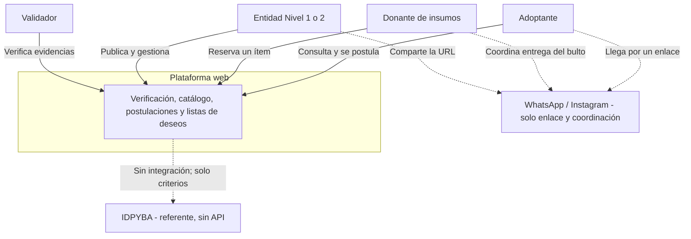
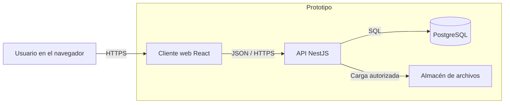
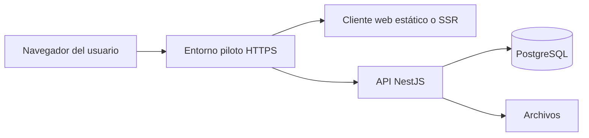

# 2.1 Arquitectura de la solución

| Campo | Valor |
|---|---|
| Código | DOC-PL-01 |
| Fase SENA | Planeación |
| Competencias | 220501094 · 220501095 |
| Estado | Vigente para el prototipo (el stack se puede sustituir por Java/Spring si el centro lo exige) |
| Fecha | 16 de agosto de 2026 |
| Parte de | [Índice de la fase 2](00-indice-de-la-fase.md) |

Este documento fija **cómo** se construye lo ya especificado en el IEEE 830 y en las historias de usuario. No inventa funciones. El UML (2.2) y la base de datos (2.3) ya están vigentes; aquí se deciden estilo, contenedores y stack.

**Vista previa:** `Ctrl+Shift+V`. Los diagramas de las secciones 2, 3 y 7 solo se dibujan ahí. Cada uno tiene pie de figura.

---

## 1. Estilo arquitectónico

**Cliente-servidor en tres capas lógicas**, desplegable como aplicación web.

| Capa | Responsabilidad |
|---|---|
| Presentación | Interfaz web responsive (público, adoptante/donante, entidad, validador). Se usa en Chrome o Safari, sobre todo en celular. |
| Aplicación (API) | Autenticación, reglas de negocio (especie, estados, puntaje, permisos por rol). Un solo backend. |
| Persistencia | PostgreSQL (datos) + almacén de archivos (fotos y evidencias). |

No hay capa de pagos. No hay cliente nativo iOS/Android en este prototipo (formulación 6.2 y 6.3). Si más adelante se integra una app, será **otro cliente** de la misma API, no un segundo sistema.

El puntaje de compatibilidad es un **módulo de reglas** dentro de la API (RF-09), no un servicio de aprendizaje automático.

---

## 2. Diagrama de contexto

El producto es independiente. WhatsApp e Instagram quedan **fuera**: son el canal por el que viaja el enlace, no un sistema integrado.

Líneas continuas = el usuario usa la plataforma. Líneas punteadas = queda fuera del software.

*Figura. Contexto: quién usa el sistema y qué queda fuera (WhatsApp, IDPYBA).*

---

## 3. Contenedores

De afuera hacia adentro: el navegador habla con el cliente web; el cliente habla con la API; la API habla con PostgreSQL y con el almacén de archivos.

*Figura. Contenedores del prototipo.*

| Contenedor | Qué garantiza del IEEE 830 |
|---|---|
| Cliente web | RNF-03 y RNF-04 (celular, Chrome / Firefox / Safari). Canal URL (6.3). |
| API | RF-07 (bloqueo de especie en servidor), RF-21 (roles), RF-09 (puntaje explicable). |
| PostgreSQL | Integridad de estados y de `especie ∈ {canino, felino}`. |
| Archivos | Evidencias de HU-03 y HU-11; no listables en público (RNF-01). |

---

## 4. Stack propuesto

Elegido para un solo aprendiz y para construir el prototipo con asistencia de código, **siempre que el centro ADSO no imponga Java**.

| Pieza | Tecnología | Por qué |
|---|---|---|
| Cliente | React (aplicación web) | Una sola interfaz responsive; encaja con el enlace de WhatsApp. |
| API | Node.js + NestJS | Módulos claros (auth, entidades, animales, postulaciones, deseos); TypeScript comparte tipos con el cliente. |
| Datos | PostgreSQL | Restricciones de dominio, claves foráneas, reportes de cupos liberados. |
| Archivos | Disco local en desarrollo; S3-compatible o equivalente en el piloto | Fotos y PDF de verificación. Límite propuesto: 5 MB por archivo. |
| Identidad | Correo + contraseña, hash con sal, sesión | RF-01 y RF-02; sin proveedor de identidad de pago. |
| Control de versiones | Git | Evidencia de ejecución. |

**Alternativa si el instructor exige Java:** Spring Boot (API) + Thymeleaf o un SPA ligero + PostgreSQL. Las capas y los contenedores **no cambian**; solo el lenguaje de la API y, si aplica, el del cliente. En ese caso se actualiza esta tabla, no el IEEE 830.

**Motor de datos:** PostgreSQL en ambos caminos. No se usa un motor distinto «por probar».

---

## 5. Decisiones que la arquitectura debe hacer cumplir

Estas reglas viven en la API, no solo en botones de la interfaz.

1. `especie` solo `canino` o `felino` (RF-07).
2. Una entidad no publica hasta verificación aprobada (RF-03, RF-04).
3. No existen módulos ni tablas de recaudo, pasarela ni apadrinamiento.
4. La bitácora pública de insumos no expone datos personales del donante (RNF-02).
5. El puntaje se calcula con las cinco respuestas de estilo de vida y se devuelve con una frase explicable (RF-08, RF-09).
6. HTTPS en el entorno de demostración (RNF-01).

---

## 6. Vistas de la interfaz (sin wireframes todavía)

Tres superficies, un solo cliente web:

1. **Pública:** catálogo, perfil de animal, badge y bitácora de la entidad.
2. **Adoptante / donante:** cuestionario, postulaciones, reservas.
3. **Entidad / validador:** alta de animal, tablero de postulaciones, deseos, cola de verificación.

Los wireframes son el artefacto 2.4. La arquitectura solo obliga a que esas superficies **no** sean tres aplicaciones distintas.

---

## 7. Despliegue (esquema; el detalle es fase 4)

*Figura. Esquema de despliegue del piloto (detalle operativo en la fase 4).*

En desarrollo: máquina local, API en un puerto, PostgreSQL en contenedor o local. En sustentación: una URL HTTPS. No se compromete alta disponibilidad 24/7 (RNF-06).

---

## 8. Trazabilidad arquitectura → requisitos

| Pieza | RF / RNF principales |
|---|---|
| Autenticación y roles en API | RF-01, RF-02, RF-21 |
| Módulo de verificación | RF-03, RF-04, RF-20 |
| Módulo de animales | RF-05 a RF-07, RF-10, RF-11 |
| Módulo de compatibilidad y postulaciones | RF-08, RF-09, RF-12 a RF-15 |
| Módulo de deseos | RF-16 a RF-19 |
| Hash, HTTPS, archivos no públicos | RNF-01, RNF-02 |
| Un cliente responsive | RNF-03, RNF-04, formulación 6.3 |

---

## 9. Qué sigue

- **2.2 UML:** vigente. Ver [2.2 Modelado UML](2.2-uml.md).
- **2.3 Base de datos:** vigente. Ver [2.3 Base de datos](2.3-base-de-datos.md).
- **2.4 UI:** wireframes de las tres superficies.

Si el centro obliga a Java, se corrige la sección 4 de este archivo **antes** de implementar, no después.
