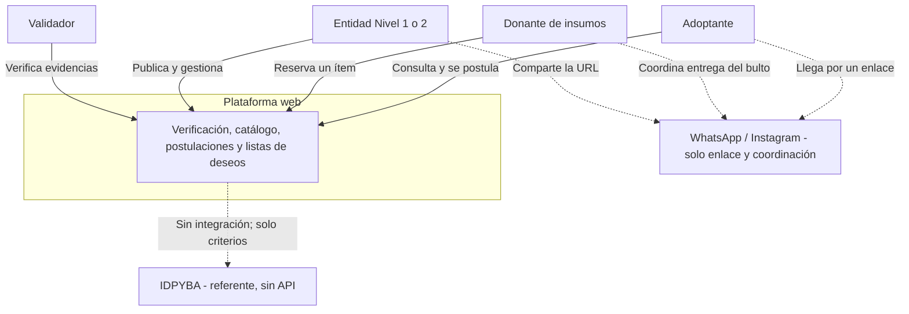
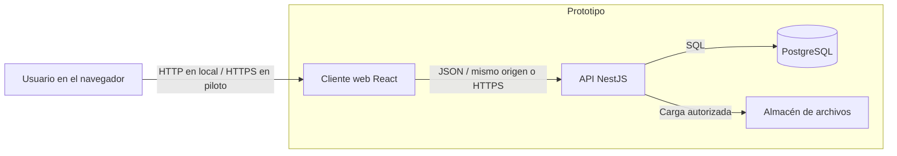
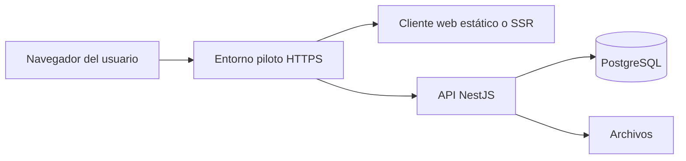

# 2.1 Arquitectura de la solución

| Campo | Valor |
|---|---|
| Código | DOC-PL-01 |
| Fase SENA | Planeación |
| Competencias | 220501094 · 220501095 |
| Estado | Vigente para el prototipo (stack Nest/React/Prisma implementado; alternativa Java/Spring si el centro lo exigiera) |
| Fecha | 3 de septiembre de 2026 |
| Parte de | [Índice de la fase 2](00-indice-de-la-fase.md) |

Fijo **cómo** se construye Mestizo a partir de lo ya especificado en el IEEE 830 y en las historias. No invento funciones. UML (2.2), datos (2.3) e interfaz (2.4) concretan este estilo.

**Vista previa:** `Ctrl+Shift+V` para los diagramas de las secciones 2, 3 y 7.

---

## 1. Estilo arquitectónico

**Cliente-servidor en tres capas lógicas**, desplegable como aplicación web.

| Capa | Responsabilidad |
|---|---|
| Presentación | Interfaz web responsive (público, adoptante/donante, entidad, validador). Se usa en Chrome, Firefox o Safari. En celular el menú va abajo; en escritorio, arriba. El cambio lo decide el **ancho del viewport**, no el User-Agent. |
| Aplicación (API) | Autenticación, reglas de negocio (especie, estados, puntaje, permisos por rol). Un solo backend. |
| Persistencia | PostgreSQL (datos) + almacén de archivos (fotos y evidencias). |

No hay capa de pagos. No hay cliente nativo iOS/Android en este prototipo (formulación 6.2 y 6.3). Si más adelante se integra una app, será **otro cliente** de la misma API, no un segundo sistema.

El puntaje de compatibilidad es un **módulo de reglas** dentro de la API (RF-09), no un servicio de aprendizaje automático.

---

## 2. Diagrama de contexto

El producto es independiente. WhatsApp e Instagram quedan **fuera**: son el canal por el que viaja el enlace, no un sistema integrado.

Líneas continuas = el usuario usa la plataforma. Líneas punteadas = queda fuera del software.

*Figura. Contexto: quién usa el sistema y qué queda fuera (WhatsApp, IDPYBA).*

---

## 3. Contenedores

De afuera hacia adentro: el navegador habla con el cliente web; el cliente habla con la API; la API habla con PostgreSQL y con el almacén de archivos.

*Figura. Contenedores del prototipo.*

| Contenedor | Qué garantiza del IEEE 830 |
|---|---|
| Cliente web | RNF-03 y RNF-04 (celular, Chrome / Firefox / Safari). Canal URL (6.3). |
| API | RF-07 (bloqueo de especie en servidor), RF-21 (roles), RF-09 (puntaje explicable). |
| PostgreSQL | Integridad de estados y de `especie ∈ {canino, felino}`. |
| Archivos | Evidencias de HU-03 y HU-11; no listables en público (RNF-01). |

---

## 4. Stack del prototipo

Elegido para el equipo de la ficha (Julio David Parada León y Brayan Alejandro Sánchez) y para cumplir el IEEE 830 con un solo cliente web. **Si el centro ADSO exigiera Java**, las capas no cambian: Spring Boot sustituye a Nest; PostgreSQL se queda.

| Pieza | Tecnología | Por qué |
|---|---|---|
| Cliente | React 19 + Vite 6 + TypeScript | Un solo SPA responsive; Vite hace de proxy `/api` en local (sin CORS inventado). TypeScript comparte el contrato de roles con la API. |
| API | Node.js + NestJS 11 + TypeScript | Módulos = dominio (auth, verificación, animales, postulaciones, deseos). Guards de sesión y rol en el servidor (RF-21). |
| Mapeo | Prisma | El `schema.prisma` es el DER del 2.3 en el repo. Las migraciones viajan con Git. |
| Datos | PostgreSQL 16 | FK y CHECK de especie; no Mongo «por probar». |
| Archivos | Disco local (`uploads/`) | Fotos y evidencias. S3 queda para un piloto posterior. |
| Identidad | JWT en cookie `httpOnly` (`sid`); hash bcryptjs (costo 12) | RF-01 y RF-02. El JS del cliente no lee el token. |
| Contenedor de datos | Docker / Podman (`compose.yml`) | Postgres en el puerto 5433. |
| Control de versiones | Git + GitHub | Evidencia de ejecución ADSO. |

**Motor de datos:** PostgreSQL en ambos caminos (Nest o Spring). No se usa un motor distinto «por probar».

---

## 5. Decisiones que la arquitectura debe hacer cumplir

Estas reglas viven en la API, no solo en botones de la interfaz.

1. `especie` solo `canino` o `felino` (RF-07).
2. Una entidad no publica hasta verificación aprobada (RF-03, RF-04).
3. No existen módulos ni tablas de recaudo, pasarela ni apadrinamiento.
4. La bitácora pública de insumos no expone datos personales del donante (RNF-02).
5. El puntaje se calcula con las cinco respuestas de estilo de vida y se devuelve con una frase explicable (RF-08, RF-09).
6. TLS (HTTPS) es el criterio de piloto (RNF-01). La sustentación local corre en HTTP: web `5173`, API `3000`.

---

## 6. Tres superficies, un cliente web

Detalle de pantallas: [2.4 Interfaz](2.4-interfaz-ui-ux.md). Aquí solo fijo que **no** son tres aplicaciones distintas:

1. **Pública:** catálogo, perfil de animal, badge y bitácora de la entidad.
2. **Adoptante / donante:** cuestionario, postulaciones, reservas.
3. **Entidad / validador:** solicitud de verificación, cola, alta de animal, tablero de postulaciones, deseos.

---

## 7. Despliegue (esquema; el detalle es fase 4)

*Figura. Esquema de despliegue del piloto (detalle operativo en la fase 4).*

En desarrollo y en la sustentación de este prototipo: máquina local, cliente en [http://localhost:5173](http://localhost:5173), API en `3000`, PostgreSQL en el puerto `5433`. Un piloto en internet sí exigiría HTTPS (RNF-01). No se compromete alta disponibilidad 24/7 (RNF-06).

---

## 8. Trazabilidad arquitectura → requisitos

| Pieza | RF / RNF principales |
|---|---|
| Autenticación y roles en API | RF-01, RF-02, RF-21 |
| Módulo de verificación | RF-03, RF-04; RF-20 (badge) |
| Módulo de animales | RF-05 a RF-07, RF-10, RF-11 |
| Módulo de compatibilidad y postulaciones | RF-08, RF-09, RF-12 a RF-15 |
| Módulo de deseos | RF-16 a RF-19; RF-20 (bitácora) |
| Hash, HTTPS, archivos no públicos | RNF-01, RNF-02 |
| Un cliente responsive | RNF-03, RNF-04, formulación 6.3 |

---

## 9. Qué sigue

- **2.2 UML:** vigente. [2.2](2.2-uml.md).
- **2.3 Base de datos:** vigente. [2.3](2.3-base-de-datos.md). El esquema ejecutable está en `api/prisma/`.
- **2.4 UI:** vigente. [2.4](2.4-interfaz-ui-ux.md).

El prototipo Nest/React ya está implementado (fase 3). Si el centro exigiera Java, se sustituye el lenguaje de la API; no se reescribe el IEEE 830.
