# 2.2 Modelado UML

| Campo | Valor |
|---|---|
| Código | DOC-PL-02 |
| Fase SENA | Planeación |
| Competencias | 220501094 · 220501095 |
| Estado | Vigente |
| Fecha | 16 de agosto de 2026 |
| Parte de | [Índice de la fase 2](00-indice-de-la-fase.md) |
| Origen | RF (1.2) e historias (1.3). No añado funciones. |

Vista previa (`Ctrl+Shift+V`). Orden: actores → casos de uso por épica → trazas → actividades → secuencias → clases → estados.

Componentes y despliegue: esbozo en el [2.1](2.1-arquitectura-de-la-solucion.md).

---

## 1. Actores

| Actor UML | Actores del backlog | Relación |
|---|---|---|
| Visitante | A-06 | Consulta catálogo y badges sin cuenta |
| Adoptante | A-03 | Se registra, responde cuestionario, se postula |
| Donante | A-04 | Reserva ítems de la lista de deseos |
| Entidad | A-01 y A-02 | Publica animales e ítems; gestiona postulaciones |
| Validador | A-05 | Resuelve verificaciones |
| Sistema | — | Aplica reglas (especie, roles, puntaje, caducidad) |

«Entidad» agrupa Nivel 1 y Nivel 2. La diferencia de nivel es de **permisos y evidencias**, no de casos de uso distintos (ninguno recauda dinero).

---

## 2. Diagramas de casos de uso (por épica)

Un solo dibujo con quince casos se vuelve ilegible. Se parte en las cuatro épicas del backlog. En estos dibujos: **círculo** = actor; **rectángulo** = caso de uso. La lista completa y las trazas RF/HU están en la **sección 3**.

### 2.1 Identidad y verificación

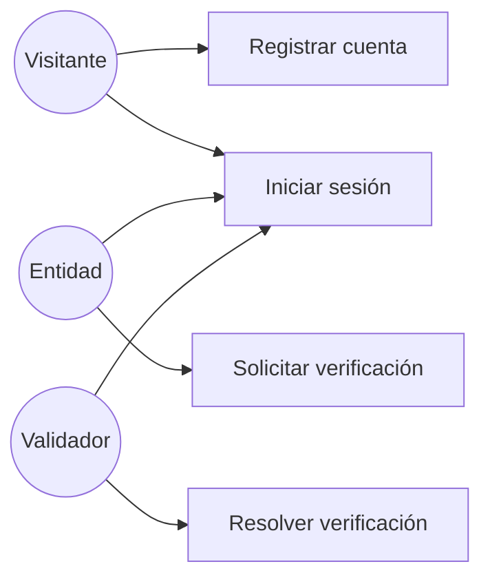

*Figura. Registro, sesión y sello de la entidad.*

### 2.2 Catálogo

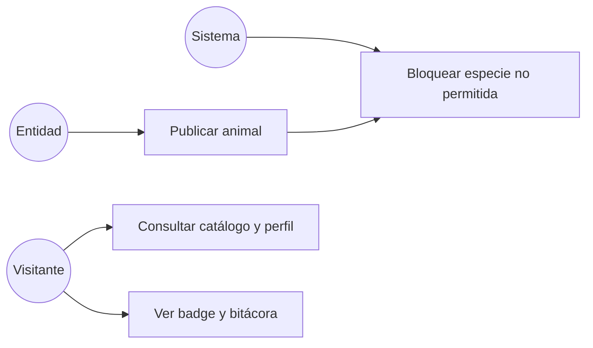

*Figura. Publicar (con bloqueo de especie) y consultar.*

### 2.3 Adopción

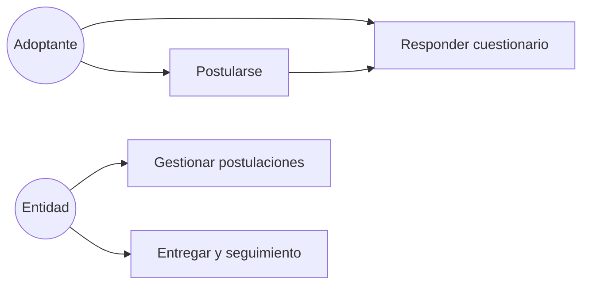

*Figura. Del cuestionario al cupo liberado. La postulación incluye el cuestionario.*

### 2.4 Listas de deseos

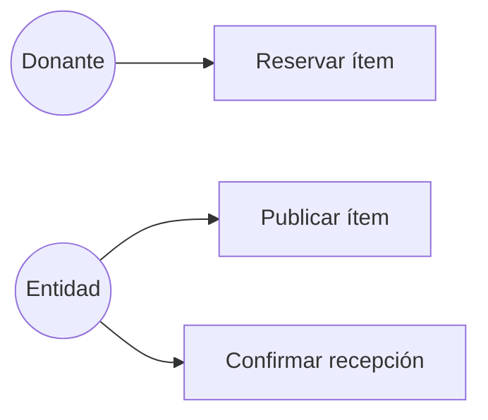

*Figura. Insumo: publicar, reservar, confirmar. La entrega física sigue en WhatsApp.*

**Should (no van en estos dibujos):** editar/archivar animal (RF-06) y caducidad a 7 días (RF-19). Están en los diagramas de estados.

---

## 3. Casos de uso por actor (trazas)

| ID UML | Caso de uso | Actor principal | RF | HU |
|---|---|---|---|---|
| UC-01 | Registrar cuenta | Visitante | RF-01 | HU-01 |
| UC-02 | Iniciar y cerrar sesión | Adoptante, Donante, Entidad, Validador | RF-02 | HU-02 |
| UC-03 | Solicitar verificación | Entidad | RF-03 | HU-03 |
| UC-04 | Resolver verificación | Validador | RF-04, RF-20, RF-21 | HU-04 |
| UC-05 | Publicar animal | Entidad | RF-05, RF-07 | HU-05 |
| UC-06 | Consultar catálogo y perfil | Visitante, Adoptante | RF-10, RF-11, RF-20 | HU-06 |
| UC-07 | Responder cuestionario | Adoptante | RF-08, RF-09 | HU-07 |
| UC-08 | Postularse | Adoptante | RF-12 | HU-08 |
| UC-09 | Gestionar postulaciones | Entidad | RF-13 | HU-09 |
| UC-10 | Entregar adopción y seguimiento | Entidad | RF-14, RF-15 | HU-09 |
| UC-11 | Publicar ítem de deseos | Entidad | RF-16 | HU-10 |
| UC-12 | Reservar ítem | Donante | RF-17 | HU-11 |
| UC-13 | Confirmar recepción | Entidad | RF-18 | HU-11 |
| UC-14 | Ver badge y bitácora | Visitante | RF-20 | HU-06, HU-04, HU-11 |
| UC-15 | Bloquear especie no permitida | Sistema | RF-07 | HU-05 |

### 3.1 Especificación breve de los cuatro flujos núcleo

**UC-04 Resolver verificación**

- Precondición: existe solicitud `en_revision` o `complemento` con evidencias de Nivel 1 o 2.
- Flujo básico: validador abre cola → revisa → aprueba → badge visible y permiso de publicar.
- Alternos: rechazo con motivo; pedido de complemento (la entidad sigue `en_revision` y puede reenviar); visita o video solo si el caso es dudoso.
- Postcondición: la entidad publica o queda rechazada. Pedir complemento no habilita publicar. No se habilita recaudo.

**UC-05 Publicar animal**

- Precondición: entidad verificada.
- Flujo básico: carga historia y convivencia → sistema valida especie canino/felino → estado `publicado`.
- Alterno: especie distinta → rechazo (UC-15).
- Postcondición: el animal entra al catálogo. Raza opcional y no es filtro protagonista.

**UC-08 Postularse**

- Precondición: adoptante autenticado con cuestionario completo; animal `publicado`.
- Flujo básico: ve perfil (historia primero) → postula → estado `enviada`.
- Alterno: animal no publicado → operación rechazada.
- Postcondición: la entidad ve la postulación con puntaje explicable. El cupo **no** se libera todavía.

**UC-13 Confirmar recepción**

- Precondición: ítem `reservado`.
- Flujo básico: entidad confirma con evidencia → `cubierto` → bitácora pública sin datos personales del donante.
- Alterno Should: sin confirmación en 7 días → vuelve a `pendiente` (RF-19).
- Postcondición: el ítem deja de aceptarse nuevas reservas.

---

## 4. Diagrama de actividades — adopción

Desde el catálogo hasta el cupo liberado. Al preseleccionar, el animal pasa a `reservado` y sale del catálogo público (coherente con el diagrama de estados y con el DER).

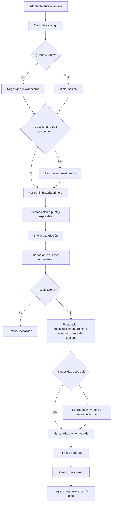

*Figura. Actividad de adopción hasta el cupo liberado.*

---

## 5. Diagrama de actividades — lista de deseos

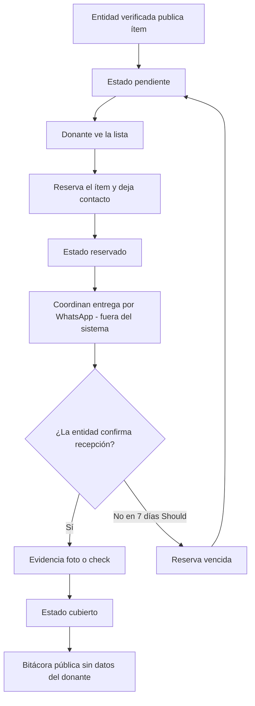

*Figura. Flujo de lista de deseos. WhatsApp queda fuera del sistema.*

---

## 6. Diagrama de secuencia — postulación

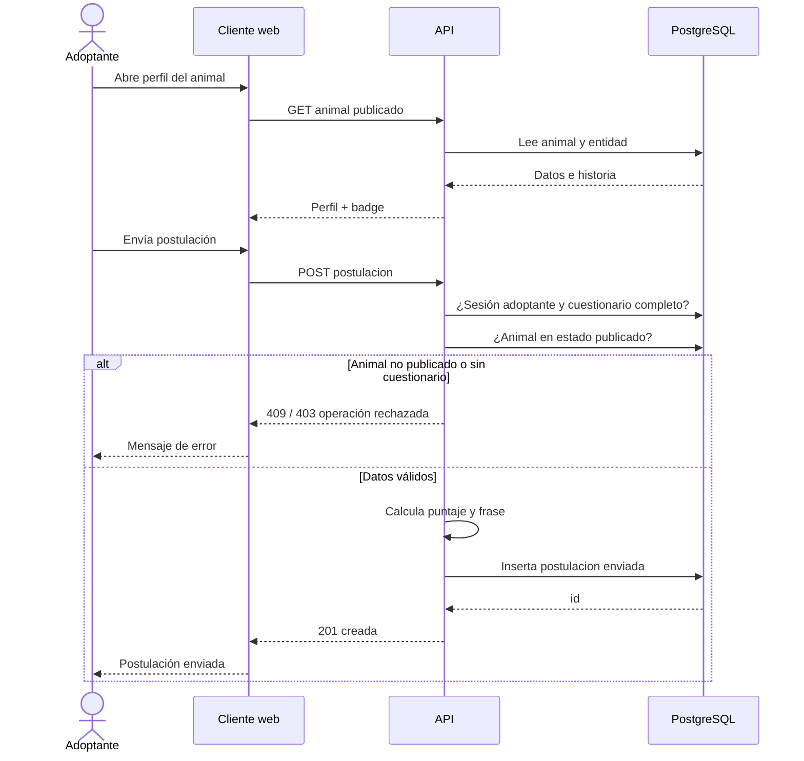

*Figura. Secuencia de una postulación válida (y el rechazo si el animal ya no está publicado).*

---

## 7. Diagrama de secuencia — confirmación de insumo

```mermaid
sequenceDiagram
    actor Donante
    actor Entidad
    participant Web as Cliente web
    participant API as API
    participant BD as PostgreSQL
    participant Files as Archivos

    Donante->>Web: Reserva ítem pendiente
    Web->>API: POST reserva
    API->>BD: Ítem pendiente → reservado
    API-->>Web: Reserva creada
    Note over Donante,Entidad: Coordinan entrega por WhatsApp. Fuera del sistema.

    Entidad->>Web: Confirma recepción
    Web->>API: POST confirmacion + evidencia
    API->>Files: Guarda foto o check
    API->>BD: Ítem cubierto; bitácora sin datos personales
    API-->>Web: Ítem cubierto
    Web-->>Entidad: Confirmado
```

*Figura. Secuencia de reserva y confirmación de insumo. WhatsApp queda fuera (nota entre actores).*

---

## 8. Diagrama de clases (dominio)

Modelo de análisis: lo que el negocio necesita persistir. Tipos y longitudes se precisan en el DER (2.3). **No hay clase de pago ni de apadrinamiento.**

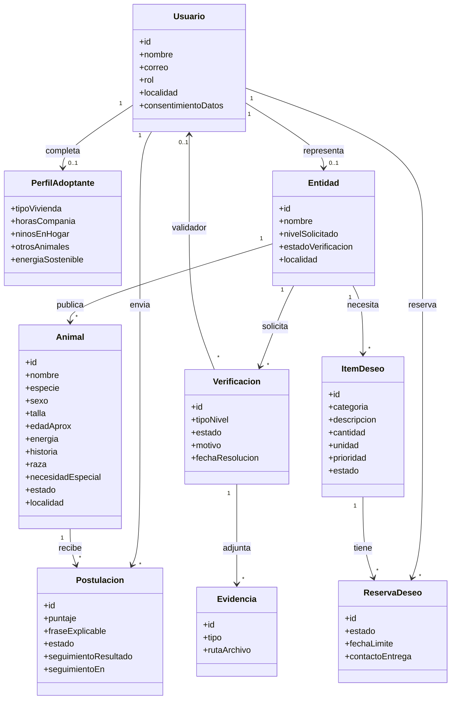

*Figura. Clases de dominio. Fotos del animal y evidencia de recepción de insumo se detallan en el DER (2.3), para no saturar este dibujo.*

**Reglas que el diagrama de clases no dibuja y el 2.3 debe imponer:**

- `Animal.especie` ∈ {canino, felino}.
- `Animal.raza` es opcional.
- Un animal `adoptado` no admite nuevas postulaciones.
- Un ítem `cubierto` no admite nuevas reservas.
- `Entidad.estadoVerificacion` ∈ {en_revision, nivel_1, nivel_2, rechazada}.

---

## 9. Diagramas de estados (apoyo al DER)

### 9.1 Entidad (badge)

La entidad **nace** `en_revision` al registrarse (RF-01): aún no hay fila en `verificacion`. Enviar evidencias no cambia el badge hasta que el validador resuelve. Pedir complemento **tampoco** cambia este diagrama: la entidad sigue `en_revision`. El estado `complemento` vive en la solicitud (9.1b).

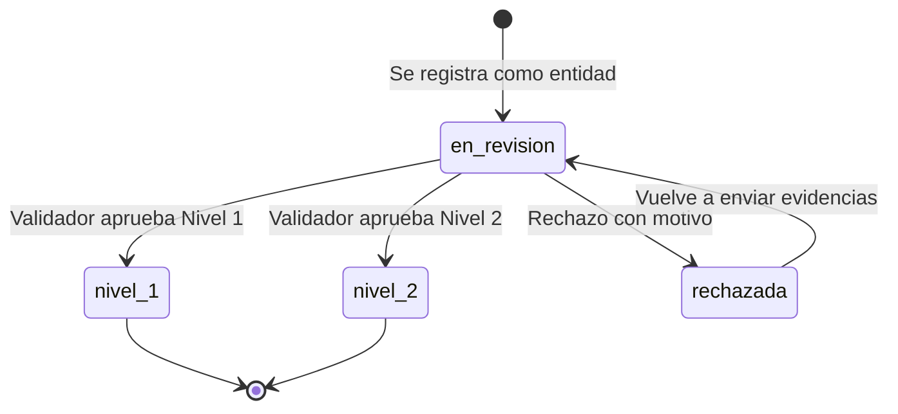

*Figura. Estados de la entidad. El badge público lee `estado_verificacion` aprobado (`nivel_1` o `nivel_2`).*

### 9.1b Solicitud de verificación

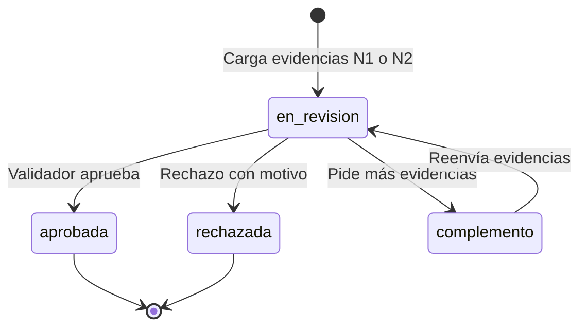

*Figura. Estados de una solicitud (`verificacion`). Una entidad puede tener historial; solo una queda `en_revision` a la vez.*

### 9.2 Animal

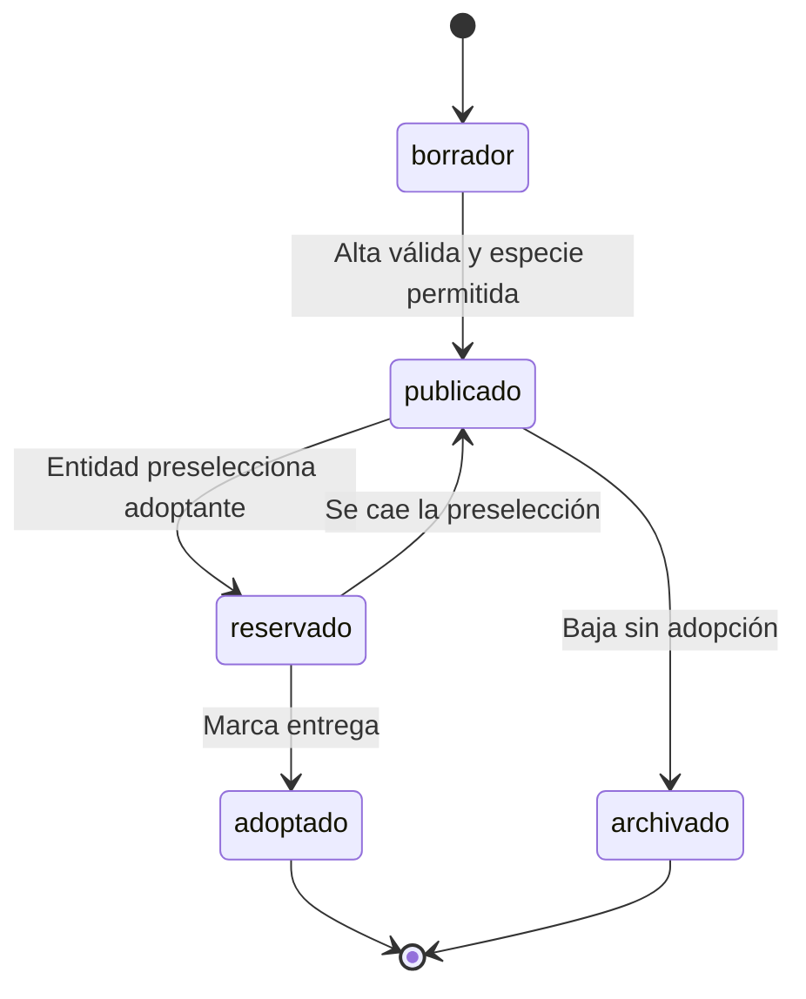

*Figura. Ciclo de vida del animal. `reservado` = hay preselección; sale del catálogo público.*

`reservado` en el animal corresponde a postulaciones `preseleccionada`. El DER (2.3) **adopta** este estado.

### 9.3 Postulación

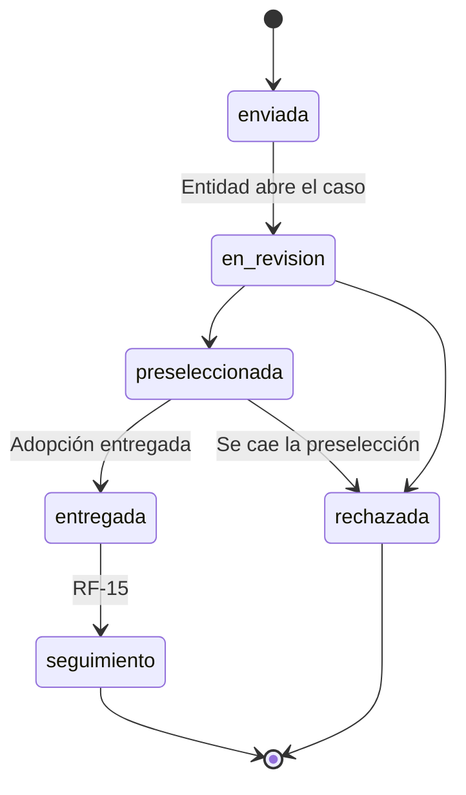

*Figura. Estados de la postulación hasta el seguimiento a 15 días (RF-15). Si se cae la preselección, pasa a `rechazada` y el animal vuelve a `publicado`.*

### 9.4 Ítem de deseos

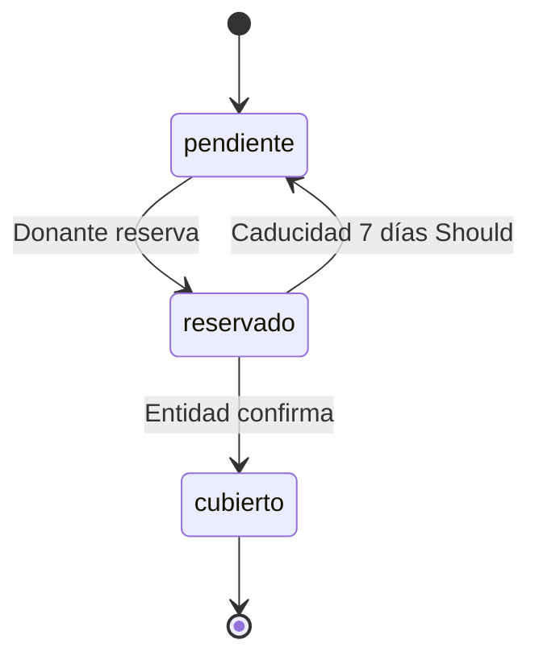

*Figura. Estados del ítem. El paso `reservado → pendiente` es Should (RF-19, caducidad a 7 días).*

---

## 10. Qué no se modela en UML

- Pasarela, apadrinamiento, micro-suscripciones.
- Cliente nativo iOS/Android (formulación 6.3).
- API del IDPYBA.
- Aprendizaje automático.
- Logística de la entrega física (WhatsApp queda fuera del sistema).

---

## 11. Qué sigue

El **2.3** traduce estas clases y estados a tablas: [2.3 Base de datos](2.3-base-de-datos.md). Las pantallas están en el [2.4](2.4-interfaz-ui-ux.md).
