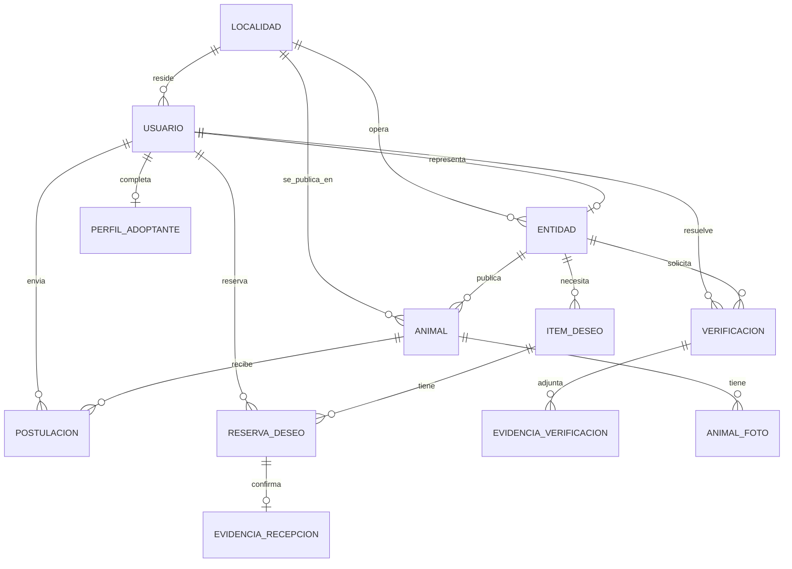

# 2.3 Base de datos

| Campo | Valor |
|---|---|
| Código | DOC-PL-03 |
| Fase SENA | Planeación |
| Competencias | 220501094 · 220501095 |
| Estado | Vigente |
| Fecha | 16 de agosto de 2026 |
| Motor | PostgreSQL (arquitectura 2.1) |
| Parte de | [Índice de la fase 2](00-indice-de-la-fase.md) |
| Origen | Clases y estados del [2.2 UML](2.2-uml.md); RF del [IEEE 830](../01-analisis/1.2-ers-ieee-830.md) |

Traduzco el dominio a persistencia, en este orden:

1. **DER** — qué se relaciona con qué (único gráfico de este archivo).
2. **Modelo relacional** — tablas, claves, integridad.
3. **Diccionario** — cada campo: tipo, obligatoriedad, dominio.

No hay tablas de recaudo, pasarela, apadrinamiento ni fauna no doméstica.

Convenciones: `snake_case`; PK `id` UUID; `creado_en` y `actualizado_en` (timestamptz) en toda tabla de negocio. Los bloques `sql` son el contrato. El esquema ejecutable está en `api/prisma/schema.prisma` y en las migraciones de la fase 3. Los índices únicos parciales (postulación activa, reserva vigente) y la vista `v_bitacora_insumos` **no** están en Prisma: la unicidad de postulación activa y la caducidad de reserva se aplican en los servicios; la bitácora pública la arma `deseos.service.ts` sin exponer al donante.

---

## 1. Decisiones de diseño

| Decisión | Qué implica |
|---|---|
| Un motor: PostgreSQL | CHECK, UNIQUE parciales y FK reales. |
| UUID como PK | No se exponen consecutivos en la URL del catálogo. |
| Estado denormalizado en `entidad` | El badge (RF-20) lee `estado_verificacion` sin recorrer el historial. El historial vive en `verificacion`. |
| Animal con estado `reservado` | Se adopta el estado del UML 2.2: al preseleccionar, el animal deja de aparecer como disponible. |
| Puntaje persistido | Se guarda en `postulacion` (número + frase) para que el tablero no lo recalcule con reglas distintas después. |
| Cuestionario en tabla propia | `perfil_adoptante` 1:1 con usuario adoptante (RF-08). |
| Fotos aparte | `animal_foto`: el Must cubre al menos una; HU-14 permite varias. |
| Evidencias en dos tablas | Verificación ≠ recepción de insumo. No se mezclan documentos de RUT con la foto de un bulto. |
| Bitácora pública = vista | `v_bitacora_insumos` no es tabla: no expone al donante (RNF-02). |
| Cupos liberados = consulta | `COUNT(*)` de animales `adoptado` por entidad. No hay tabla de métrica. |
| Sesión | No se persiste en el modelo: cookie `httpOnly` `sid` (arquitectura 2.1). |
| Localidad | Catálogo `localidad` (localidades urbanas de Bogotá). |

Forma normal: 3FN. La única redundancia controlada es `entidad.estado_verificacion` (copia del último resultado de `verificacion`).

---

## 2. Modelo entidad-relación (DER)

El DER responde *qué se relaciona con qué*. No muestra tipos de dato: eso va en el diccionario (punto 4).



*Figura. DER del prototipo. `||--o{` = uno a muchos (cero permitidos); `||--o|` = uno a uno opcional. Una entidad puede existir sin solicitud, sin animales y sin ítems.*

### 2.1 Cardinalidades

| Relación | Cardinalidad | Regla |
|---|---|---|
| USUARIO — ENTIDAD | 1:0..1 | Solo el rol `entidad` tiene fila en `entidad`. |
| USUARIO — PERFIL_ADOPTANTE | 1:0..1 | Obligatorio para postularse (RF-08, RF-12). |
| ENTIDAD — VERIFICACION | 1:0..N | Historial de solicitudes. Al registrarse la entidad **no** tiene fila aquí; la primera se crea en HU-03. |
| VERIFICACION — EVIDENCIA_VERIFICACION | 1:0..N | Al persistir una solicitud válida: Nivel 1 exige tres tipos; Nivel 2 al menos uno. |
| ENTIDAD — ANIMAL | 1:0..N | Cero hasta que publique (HU-05). |
| ANIMAL — ANIMAL_FOTO | 1:0..N | Must: ≥ 1 al publicar. |
| ANIMAL — POSTULACION | 1:0..N | Un adoptante puede tener historial; una sola postulación **activa** por par. |
| USUARIO — POSTULACION | 1:0..N | El adoptante. |
| ENTIDAD — ITEM_DESEO | 1:0..N | Cero hasta que publique deseos (HU-10). |
| ITEM_DESEO — RESERVA_DESEO | 1:0..N | Una reserva vigente a la vez si el ítem está `reservado`. |
| USUARIO — RESERVA_DESEO | 1:0..N | El donante. |
| RESERVA_DESEO — EVIDENCIA_RECEPCION | 1:0..1 | Al confirmar (RF-18). |
| USUARIO — VERIFICACION | 1:0..N | El validador que resuelve (`validador_id`, nulo mientras esté `en_revision`). |
| LOCALIDAD — USUARIO / ENTIDAD / ANIMAL | 1:N | Área urbana de Bogotá. |

---

## 3. Modelo relacional

Notación: **PK** clave primaria, **FK** foránea, **UK** única. Motor: PostgreSQL.

### 3.1 Esquema de tablas

Esto **no** es un diagrama: es el modelo relacional en notación de esquema (una fila = una tabla). El gráfico de cajas y rombos está en el **punto 2 (DER)**. Aquí **PK** va en negrita, **FK** se indica en la columna de claves foráneas.

En la vista previa (`Ctrl+Shift+V`) debe verse como **tabla**, no como un bloque de código partido.

| Relación | Esquema (atributos) | Claves foráneas |
|---|---|---|
| localidad | **id**, nombre (UK), codigo (UK) | — |
| usuario | **id**, correo (UK), hash_contrasena, nombre, rol, localidad_id, consentimiento_datos, consentimiento_en, creado_en, actualizado_en | localidad_id → localidad |
| entidad | **id**, usuario_id (UK), nombre, nivel_solicitado, estado_verificacion, localidad_id, creado_en, actualizado_en | usuario_id → usuario; localidad_id → localidad |
| verificacion | **id**, entidad_id, tipo_nivel, estado, motivo, validador_id (N), resuelto_en, creado_en, actualizado_en | entidad_id → entidad; validador_id → usuario |
| evidencia_verificacion | **id**, verificacion_id, tipo_documento, ruta_archivo, mime, peso_bytes, creado_en | verificacion_id → verificacion |
| perfil_adoptante | **usuario_id**, tipo_vivienda, horas_compania, ninos_en_hogar, otros_animales, energia_sostenible, actualizado_en | usuario_id → usuario |
| animal | **id**, entidad_id, nombre, especie, sexo, talla, edad_aprox, energia, historia, raza (N), necesidad_especial, convive_ninos, convive_otros_animales, esterilizado (N), estado, localidad_id, creado_en, actualizado_en | entidad_id → entidad; localidad_id → localidad |
| animal_foto | **id**, animal_id, ruta_archivo, es_portada, orden, mime, peso_bytes, creado_en | animal_id → animal |
| postulacion | **id**, animal_id, adoptante_id, puntaje, frase_explicable, estado, requiere_evidencia_hogar, seguimiento_resultado (N), seguimiento_en (N), creado_en, actualizado_en | animal_id → animal; adoptante_id → usuario |
| item_deseo | **id**, entidad_id, categoria, descripcion, cantidad, unidad, prioridad, estado, creado_en, actualizado_en | entidad_id → entidad |
| reserva_deseo | **id**, item_deseo_id, donante_id, estado, contacto_entrega, fecha_limite, creado_en, actualizado_en | item_deseo_id → item_deseo; donante_id → usuario |
| evidencia_recepcion | **id**, reserva_deseo_id (UK), ruta_archivo (N), check_recibido, mime (N), peso_bytes (N), creado_en | reserva_deseo_id → reserva_deseo |

N = admite nulo. El detalle de tipos y dominios está en el **punto 4 (diccionario)**. Las acciones ON DELETE, en el **3.2**.

### 3.2 Claves foráneas

| Tabla | Columna | Referencia | ON DELETE |
|---|---|---|---|
| usuario | localidad_id | localidad(id) | RESTRICT |
| entidad | usuario_id | usuario(id) | RESTRICT |
| entidad | localidad_id | localidad(id) | RESTRICT |
| verificacion | entidad_id | entidad(id) | CASCADE |
| verificacion | validador_id | usuario(id) | RESTRICT |
| evidencia_verificacion | verificacion_id | verificacion(id) | CASCADE |
| perfil_adoptante | usuario_id | usuario(id) | CASCADE |
| animal | entidad_id | entidad(id) | RESTRICT |
| animal | localidad_id | localidad(id) | RESTRICT |
| animal_foto | animal_id | animal(id) | CASCADE |
| postulacion | animal_id | animal(id) | RESTRICT |
| postulacion | adoptante_id | usuario(id) | RESTRICT |
| item_deseo | entidad_id | entidad(id) | RESTRICT |
| reserva_deseo | item_deseo_id | item_deseo(id) | RESTRICT |
| reserva_deseo | donante_id | usuario(id) | RESTRICT |
| evidencia_recepcion | reserva_deseo_id | reserva_deseo(id) | CASCADE |

No se borra un animal adoptado ni una postulación (RF-14): se cambia el estado. `RESTRICT` evita borrados accidentales de historial.

### 3.3 Índices

Aceleran el catálogo, el tablero de postulaciones y la cola de verificación. Los bloques siguientes son **SQL de referencia** (fase 3); en la preview se ven como código, no como diagrama.

| Índice | Tabla | Columnas | Para qué |
|---|---|---|---|
| UK | usuario | correo | RF-01 |
| UK | entidad | usuario_id | Un usuario, una entidad |
| UK | evidencia_recepcion | reserva_deseo_id | Una evidencia por reserva |
| IX | animal | estado, especie, localidad_id | Catálogo RF-10 |
| IX | animal | entidad_id | Tablero de la entidad |
| IX | postulacion | animal_id, estado | UC-09 |
| IX | postulacion | adoptante_id | Mis postulaciones |
| IX | item_deseo | entidad_id, estado | Lista de deseos |
| IX | reserva_deseo | item_deseo_id, estado | Reserva vigente |
| IX | verificacion | estado | Cola del validador |

Índice único **parcial** (PostgreSQL):

```sql
CREATE UNIQUE INDEX uk_postulacion_activa
  ON postulacion (animal_id, adoptante_id)
  WHERE estado IN ('enviada', 'en_revision', 'preseleccionada');
```

```sql
CREATE UNIQUE INDEX uk_reserva_vigente
  ON reserva_deseo (item_deseo_id)
  WHERE estado = 'reservado';
```

### 3.4 Vista pública de insumos (RF-20 bitácora, RNF-02)

SQL de referencia para el **módulo 5** (listas de deseos). La vista **no** incluye `donante_id`, correo ni `contacto_entrega`. El badge (RF-20) no depende de esta vista: lee `entidad.estado_verificacion`.

```sql
CREATE VIEW v_bitacora_insumos AS
SELECT
  e.id AS entidad_id,
  e.nombre AS entidad_nombre,
  e.estado_verificacion AS badge,
  i.categoria,
  i.descripcion,
  i.cantidad,
  i.unidad,
  er.creado_en AS cubierto_en
FROM item_deseo i
JOIN entidad e ON e.id = i.entidad_id
JOIN reserva_deseo r ON r.item_deseo_id = i.id AND r.estado = 'cubierto'
JOIN evidencia_recepcion er ON er.reserva_deseo_id = r.id
WHERE i.estado = 'cubierto';
```

### 3.5 Métrica norte (cupo)

Consulta, no tabla. SQL de referencia:

```sql
SELECT entidad_id, COUNT(*) AS cupos_liberados
FROM animal
WHERE estado = 'adoptado'
GROUP BY entidad_id;
```

---

## 4. Diccionario de datos

Leyenda: **N** = nulo permitido. **Dom** = dominio / CHECK.

### 4.1 `localidad`

| Columna | Tipo | N | Dom / descripción |
|---|---|---|---|
| id | UUID | No | PK |
| nombre | VARCHAR(80) | No | Único. Ej. Engativá, Kennedy, Suba |
| codigo | VARCHAR(20) | No | Único. Código corto de localidad |

Semilla: las 19 localidades urbanas de Bogotá D.C. (se excluye Sumapaz por el alcance «área urbana»). Lista: Usaquén, Chapinero, Santa Fe, San Cristóbal, Usme, Tunjuelito, Bosa, Kennedy, Fontibón, Engativá, Suba, Barrios Unidos, Teusaquillo, Los Mártires, Antonio Nariño, Puente Aranda, La Candelaria, Rafael Uribe Uribe, Ciudad Bolívar.

### 4.2 `usuario`

| Columna | Tipo | N | Dom / descripción |
|---|---|---|---|
| id | UUID | No | PK |
| correo | VARCHAR(254) | No | UK. RFC 5321 práctico |
| hash_contrasena | VARCHAR(255) | No | Hash + sal. Nunca texto plano (RNF-01) |
| nombre | VARCHAR(120) | No | Nombre para mostrar |
| rol | VARCHAR(20) | No | `adoptante` \| `donante` \| `entidad` \| `validador` |
| localidad_id | UUID | No | FK localidad |
| consentimiento_datos | BOOLEAN | No | Debe ser true al insertar (Ley 1581) |
| consentimiento_en | TIMESTAMPTZ | No | Momento del consentimiento |
| creado_en | TIMESTAMPTZ | No | |
| actualizado_en | TIMESTAMPTZ | No | |

El rol `validador` no se autoasigna en el registro público; lo crea el operador del piloto.

### 4.3 `entidad`

| Columna | Tipo | N | Dom / descripción |
|---|---|---|---|
| id | UUID | No | PK |
| usuario_id | UUID | No | UK, FK usuario. El usuario debe tener rol `entidad` |
| nombre | VARCHAR(160) | No | Nombre del albergue o hogar de paso |
| nivel_solicitado | VARCHAR(10) | No | `nivel_1` \| `nivel_2` |
| estado_verificacion | VARCHAR(20) | No | `en_revision` \| `nivel_1` \| `nivel_2` \| `rechazada` |
| localidad_id | UUID | No | FK. Donde opera |
| creado_en | TIMESTAMPTZ | No | |
| actualizado_en | TIMESTAMPTZ | No | |

Publicar animales o ítems solo si `estado_verificacion` ∈ {`nivel_1`, `nivel_2`}.

Al insertar la entidad en el registro (RF-01) nace con `estado_verificacion = en_revision` **sin** fila en `verificacion`. El historial empieza cuando carga evidencias (RF-03).

### 4.4 `verificacion`

| Columna | Tipo | N | Dom / descripción |
|---|---|---|---|
| id | UUID | No | PK |
| entidad_id | UUID | No | FK |
| tipo_nivel | VARCHAR(10) | No | `nivel_1` \| `nivel_2` |
| estado | VARCHAR(20) | No | `en_revision` \| `aprobada` \| `rechazada` \| `complemento` |
| motivo | TEXT | Sí | Obligatorio si `rechazada` o `complemento` |
| validador_id | UUID | Sí | FK usuario rol `validador`. Nulo hasta resolver |
| resuelto_en | TIMESTAMPTZ | Sí | |
| creado_en | TIMESTAMPTZ | No | |
| actualizado_en | TIMESTAMPTZ | No | |

Al aprobar: se copia a `entidad.estado_verificacion` el valor `nivel_1` o `nivel_2` según `tipo_nivel`.

### 4.5 `evidencia_verificacion`

| Columna | Tipo | N | Dom / descripción |
|---|---|---|---|
| id | UUID | No | PK |
| verificacion_id | UUID | No | FK |
| tipo_documento | VARCHAR(40) | No | Nivel 1: `rut`, `camara_comercio`, `representacion_legal`. Nivel 2: `evidencia_idpyba`, `carta_comvezcol` |
| ruta_archivo | VARCHAR(500) | No | Ruta en el almacén. No listable en público |
| mime | VARCHAR(80) | No | `application/pdf`, `image/jpeg`, `image/png` |
| peso_bytes | INTEGER | No | ≤ 5 242 880 (5 MB) |
| creado_en | TIMESTAMPTZ | No | |

### 4.6 `perfil_adoptante`

| Columna | Tipo | N | Dom / descripción |
|---|---|---|---|
| usuario_id | UUID | No | PK y FK. Usuario rol `adoptante` |
| tipo_vivienda | VARCHAR(40) | No | `apartamento` \| `casa` \| `casa_con_patio` \| `otro` |
| horas_compania | SMALLINT | No | 0–24. Horas de compañía al día |
| ninos_en_hogar | BOOLEAN | No | |
| otros_animales | VARCHAR(40) | No | `ninguno` \| `perro` \| `gato` \| `ambos` \| `otros` |
| energia_sostenible | VARCHAR(10) | No | `baja` \| `media` \| `alta` |
| actualizado_en | TIMESTAMPTZ | No | |

### 4.7 `animal`

| Columna | Tipo | N | Dom / descripción |
|---|---|---|---|
| id | UUID | No | PK |
| entidad_id | UUID | No | FK. La entidad debe estar verificada |
| nombre | VARCHAR(80) | No | |
| especie | VARCHAR(10) | No | **`canino` \| `felino` únicamente (RF-07)** |
| sexo | VARCHAR(10) | No | `macho` \| `hembra` |
| talla | VARCHAR(10) | No | `pequeno` \| `mediano` \| `grande` |
| edad_aprox | VARCHAR(20) | No | Texto controlado: `cachorro`, `joven`, `adulto`, `senior` |
| energia | VARCHAR(10) | No | `baja` \| `media` \| `alta` |
| historia | TEXT | No | Campo protagonista del perfil (anti-sesgo) |
| raza | VARCHAR(80) | Sí | Opcional. **No** hay filtro por raza en el catálogo |
| necesidad_especial | BOOLEAN | No | Default false. Si true, el perfil no se oculta |
| convive_ninos | BOOLEAN | No | |
| convive_otros_animales | BOOLEAN | No | |
| esterilizado | BOOLEAN | Sí | Null = no se conoce |
| estado | VARCHAR(20) | No | `borrador` \| `publicado` \| `reservado` \| `adoptado` \| `archivado` |
| localidad_id | UUID | No | FK. Dónde está el animal |
| creado_en | TIMESTAMPTZ | No | |
| actualizado_en | TIMESTAMPTZ | No | |

Catálogo público: `estado = 'publicado'`. `borrador` = alta incompleta (no sale al público; alinea RF-05). `reservado` = hay preselección (no se postula de nuevo). `adoptado` = cupo liberado. `archivado` = baja sin adopción (RF-06 Should).

### 4.8 `animal_foto`

| Columna | Tipo | N | Dom / descripción |
|---|---|---|---|
| id | UUID | No | PK |
| animal_id | UUID | No | FK |
| ruta_archivo | VARCHAR(500) | No | |
| es_portada | BOOLEAN | No | Una sola portada por animal (regla de aplicación) |
| orden | SMALLINT | No | ≥ 1 |
| mime | VARCHAR(80) | No | `image/jpeg` \| `image/png` \| `image/webp` |
| peso_bytes | INTEGER | No | ≤ 5 MB |
| creado_en | TIMESTAMPTZ | No | |

### 4.9 `postulacion`

| Columna | Tipo | N | Dom / descripción |
|---|---|---|---|
| id | UUID | No | PK |
| animal_id | UUID | No | FK. Animal `publicado` o `reservado` |
| adoptante_id | UUID | No | FK usuario rol `adoptante` con perfil completo |
| puntaje | SMALLINT | No | 0–100. Calculado por reglas RF-09 |
| frase_explicable | VARCHAR(280) | No | Ej. «Coincide en vivienda y energía; no convive bien con gatos» |
| estado | VARCHAR(20) | No | `enviada` \| `en_revision` \| `preseleccionada` \| `rechazada` \| `entregada` \| `seguimiento` |
| requiere_evidencia_hogar | BOOLEAN | No | Default false. RF-13 |
| seguimiento_resultado | VARCHAR(20) | Sí | `estable` \| `novedad` \| `retorno`. Obligatorio en estado `seguimiento` (RF-15) |
| seguimiento_en | TIMESTAMPTZ | Sí | |
| creado_en | TIMESTAMPTZ | No | |
| actualizado_en | TIMESTAMPTZ | No | |

Al pasar a `preseleccionada`: `animal.estado = reservado`. Si se cae la preselección: esa postulación pasa a `rechazada` y el animal vuelve a `publicado` (coherente con el UML 2.2). Al `entregada`: `animal.estado = adoptado` y el resto de postulaciones activas de ese animal pasan a `rechazada` (regla de aplicación).

### 4.10 `item_deseo`

| Columna | Tipo | N | Dom / descripción |
|---|---|---|---|
| id | UUID | No | PK |
| entidad_id | UUID | No | FK entidad verificada |
| categoria | VARCHAR(20) | No | `alimento` \| `medicina` \| `aseo` |
| descripcion | VARCHAR(200) | No | Ej. «Bulto de concentrado 15 kg adultos» |
| cantidad | INTEGER | No | ≥ 1 |
| unidad | VARCHAR(30) | No | `bulto`, `unidad`, `caja`, `saco`, `ml` |
| prioridad | VARCHAR(10) | No | `baja` \| `media` \| `alta` |
| estado | VARCHAR(20) | No | `pendiente` \| `reservado` \| `cubierto` |
| creado_en | TIMESTAMPTZ | No | |
| actualizado_en | TIMESTAMPTZ | No | |

**No existe** columna de valor en COP ni de Nequi (RF-16).

### 4.11 `reserva_deseo`

| Columna | Tipo | N | Dom / descripción |
|---|---|---|---|
| id | UUID | No | PK |
| item_deseo_id | UUID | No | FK |
| donante_id | UUID | No | FK usuario rol `donante` |
| estado | VARCHAR(20) | No | `reservado` \| `cubierto` \| `vencido` |
| contacto_entrega | VARCHAR(120) | No | Teléfono o medio para coordinar **fuera** del sistema. No sale en la bitácora pública |
| fecha_limite | DATE | No | `creado_en` + 7 días (RF-19 Should) |
| creado_en | TIMESTAMPTZ | No | |
| actualizado_en | TIMESTAMPTZ | No | |

### 4.12 `evidencia_recepcion`

| Columna | Tipo | N | Dom / descripción |
|---|---|---|---|
| id | UUID | No | PK |
| reserva_deseo_id | UUID | No | UK, FK |
| ruta_archivo | VARCHAR(500) | Sí | Foto. Nulo si solo `check_recibido` |
| check_recibido | BOOLEAN | No | True al confirmar |
| mime | VARCHAR(80) | Sí | |
| peso_bytes | INTEGER | Sí | ≤ 5 MB si hay archivo |
| creado_en | TIMESTAMPTZ | No | |

Al insertar: `reserva_deseo.estado = cubierto` e `item_deseo.estado = cubierto`.

---

## 5. Restricciones de integridad (CHECK y reglas de aplicación)

### 5.1 En base de datos (CHECK)

SQL de referencia (fase 3). Equivalentes para los demás ENUM del diccionario (`categoria`, estados de ítem y postulación, etc.).

```sql
ALTER TABLE animal
  ADD CONSTRAINT ck_animal_especie
  CHECK (especie IN ('canino', 'felino'));

ALTER TABLE animal
  ADD CONSTRAINT ck_animal_estado
  CHECK (estado IN ('borrador', 'publicado', 'reservado', 'adoptado', 'archivado'));

ALTER TABLE usuario
  ADD CONSTRAINT ck_usuario_rol
  CHECK (rol IN ('adoptante', 'donante', 'entidad', 'validador'));

ALTER TABLE usuario
  ADD CONSTRAINT ck_usuario_consentimiento
  CHECK (consentimiento_datos = TRUE);

ALTER TABLE evidencia_verificacion
  ADD CONSTRAINT ck_evidencia_peso
  CHECK (peso_bytes > 0 AND peso_bytes <= 5242880);

ALTER TABLE animal_foto
  ADD CONSTRAINT ck_foto_peso
  CHECK (peso_bytes > 0 AND peso_bytes <= 5242880);
```

### 5.2 En la API (no solo en la interfaz)

Estas no se expresan bien con un CHECK simple; la API las garantiza (RNF-07):

1. No insertar `animal` si `entidad.estado_verificacion` ∉ {`nivel_1`, `nivel_2`}.
2. No **insertar** `postulacion` si el animal no está `publicado` o si falta `perfil_adoptante`. Una fila ya creada puede quedar asociada a un animal que después pasa a `reservado`.
3. No insertar `postulacion` si el animal está `reservado`, `adoptado` o `archivado`.
4. No insertar `reserva_deseo` si el ítem no está `pendiente`.
5. `especie` distinta de canino/felino: rechazo 400 también si alguien omite el CHECK.
6. El registro público no crea rol `validador`.
7. La bitácora y el GET público de entidad no devuelven datos del donante.

### 5.3 Lo que no existe en el esquema

- Tablas `pago`, `suscripcion`, `apadrinamiento`, `pasarela`.
- Atributo `valor_cop` o `nequi`.
- Tabla de especies silvestres.
- Integración IDPYBA.

---

## 6. Trazabilidad modelo → requisitos

| Tabla / vista | RF / RNF |
|---|---|
| usuario | RF-01, RF-02, RF-21, RNF-01, RNF-02 |
| entidad, verificacion, evidencia_verificacion | RF-03, RF-04, RF-20 |
| animal, animal_foto | RF-05, RF-06, RF-07, RF-10, RF-11 |
| perfil_adoptante, postulacion | RF-08, RF-09, RF-12 a RF-15 |
| item_deseo, reserva_deseo, evidencia_recepcion | RF-16 a RF-19 |
| v_bitacora_insumos | RF-20, RNF-02 |
| COUNT animal adoptado | Métrica norte |
| localidad | Alcance Bogotá urbana |

---

## 7. Cálculo del puntaje (persistido, no es tabla)

No hay tabla de «modelo ML». La API compara `perfil_adoptante` con `animal` y escribe `postulacion.puntaje` y `frase_explicable`.

Propuesta de reglas (0–100), documentada para sustentación y para el 2.2 RF-09:

| Criterio | Puntos si coincide | Si choca |
|---|---|---|
| Energía vs `energia_sostenible` | +25 | 0 y se menciona en la frase |
| `ninos_en_hogar` vs `convive_ninos` | +20 | 0 y frase de choque |
| `otros_animales` vs `convive_otros_animales` | +20 | 0 y frase de choque |
| Vivienda (casa_con_patio favorece perro grande) | +20 | +10 neutro |
| Horas de compañía vs energía alta | +15 | +5 |

La frase concatena coincidencias y choques. El código canónico es `api/src/dominio/puntaje.ts`. Ajustar pesos es ejecución **sin cambiar el esquema**.

---

## 8. Script de creación (esqueleto)

Orden de `CREATE TABLE` (respeta FK):

1. `localidad`
2. `usuario`
3. `entidad`
4. `verificacion`
5. `evidencia_verificacion`
6. `perfil_adoptante`
7. `animal`
8. `animal_foto`
9. `postulacion`
10. `item_deseo`
11. `reserva_deseo`
12. `evidencia_recepcion`
13. Vista `v_bitacora_insumos`
14. Índices de la sección 3.3

El SQL ejecutable (tipos exactos, seed de localidades) está en `api/prisma/migrations/` y `api/prisma/seed.ts`. Este 2.3 sigue siendo el contrato: la implementación no añade tablas de dinero ni quita el CHECK de `especie`.

---

## 9. Qué sigue

**2.4 Interfaz:** [2.4](2.4-interfaz-ui-ux.md). Las pantallas usan estos campos (historia primero, raza al final, badge leído de `entidad.estado_verificacion`, lista de deseos sin COP).
