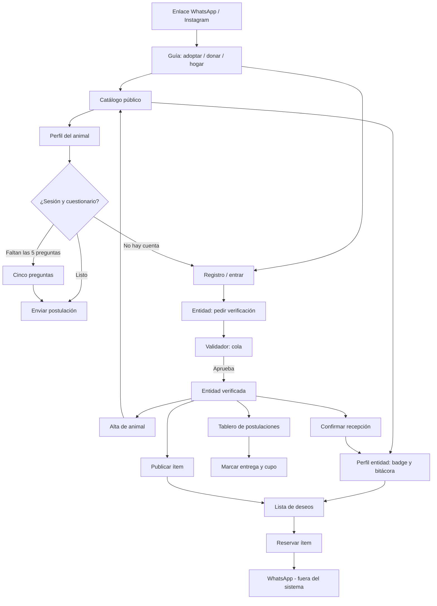

# 2.4 Interfaz (UI/UX)

| Campo | Valor |
|---|---|
| Código | DOC-PL-04 |
| Fase SENA | Planeación |
| Competencias | 220501094 · 220501095 |
| Estado | Vigente — prototipo construido (wireframes = contenido; el look vive en el cliente web) |
| Fecha | 3 de septiembre de 2026 |
| Parte de | [Índice de la fase 2](00-indice-de-la-fase.md) |
| Origen | RF (1.2), HU (1.3), superficies del [2.1](2.1-arquitectura-de-la-solucion.md), campos del [2.3](2.3-base-de-datos.md) |

Traduzco requisitos a pantallas. No añado funciones. Un solo cliente web, pensado para **celular** (el enlace llega por WhatsApp o Instagram).

Estos dibujos son de **baja fidelidad**: cajas, textos y orden. No son el look final. La marca de producto es **Mestizo**.

Vista previa (`Ctrl+Shift+V`).

---

## 1. Reglas de pantalla (antes de dibujar)

Salen del IEEE 830 y del diccionario 2.3. Si una pantalla las rompe, está mal, por más “bonita” que se vea.

| Regla | De dónde | Qué se ve |
|---|---|---|
| Historia primero, raza al final (o no va) | RF-10, RF-11 | En el perfil, el bloque de historia está arriba; la raza no es filtro del catálogo |
| Filtros del catálogo: especie y localidad | RF-10 | **No existe** filtro por raza |
| Necesidad especial visible, nunca oculta | RF-05, HU-05 | Etiqueta en la tarjeta y en el perfil |
| Badge de la entidad siempre a la vista | RF-20 | Nivel 1, Nivel 2 o «en revisión» |
| Cinco preguntas, no un formulario-auditoría | RF-08, RNF-03 | Una pantalla; se reutiliza al postularse (RF-12) |
| Puntaje con frase, no un número solo | RF-09 | «Coincide en vivienda; no convive bien con gatos» |
| Sin Nequi, sin COP, sin apadrinar | RF-16, 6.2 | Lista de deseos: categoría, cantidad, unidad |
| Bitácora pública sin datos del donante | RNF-02 | Ítem + fecha; ni teléfono ni nombre |
| Especie solo canino / felino | RF-07 | Select cerrado; el servidor también rechaza |
| Una mano, un pulgar | RNF-03, 1.4 | Botón primario abajo; no hay tablas anchas de escritorio como única vista |
| Entidad no publica hasta estar verificada | RF-03, RF-04 | Alta de animal y de ítem bloqueados con mensaje claro |

---

## 2. Tres superficies, un cliente

Igual que en el 2.1. No son tres apps.

| Superficie | Quién | Pantallas Must |
|---|---|---|
| Pública | Visitante (A-06) | Catálogo, perfil de animal, perfil de entidad (badge + bitácora) |
| Adoptante / donante | A-03, A-04 | Registro, sesión, cuestionario, postulación, reserva de ítem |
| Entidad / validador | A-01, A-02, A-05 | Solicitud de verificación, cola, alta de animal, tablero, deseos, confirmación |

El menú cambia según el rol (`web/src/componentes/MenuRol.tsx`). En celular va abajo; en escritorio, en la barra. Visitante: Inicio, Catálogo, Entrar, Crear cuenta. Adoptante: Catálogo, Postulaciones, Cuenta. Donante: Necesidades, Catálogo, Cuenta. Tras entrar, el donante aterriza en hogares con ítems pendientes (no en el catálogo de animales). Entidad con sello: Catálogo, Postulaciones, Deseos, Publicar, Cuenta. Entidad sin sello: Catálogo y Cuenta (desde ahí pide verificación). Validador: Catálogo, Cola, Cuenta. El adoptante **no** ve Deseos en el menú: reserva desde el perfil público de la entidad. La guía interactiva (`inicio`) solo aparece si no hay sesión: tres caminos (adoptar, donar insumo u hogar de paso). Quien ya entró no la ve en el menú ni en el catálogo.

---

## 3. Mapa de navegación



*Figura. Navegación del prototipo. El validador solo resuelve la cola; publicar animales e ítems es de la entidad ya verificada. WhatsApp solo aparece como salida, no como pantalla.*

---

## 4. Cómo leer los wireframes

Ancho de referencia: celular (~360 px). Leyenda:

- `[ Botón ]` acción primaria o secundaria
- `________` campo de texto
- `( )` opción
- `█` foto o evidencia
- Texto en *cursiva* = contenido de ejemplo, no etiqueta de UI

No dibujo un segundo producto de escritorio: si cabe en una mano, escala a tablet y a pantalla ancha. A partir de ~720 px el menú pasa a la barra superior, el catálogo se arma en columnas y los botones se agrupan en fila. Eso lo hace CSS por viewport (RNF-04), no un detector de «es celular». Cada caja ASCII de las secciones 5 a 7 es la **figura** de esa pantalla (UI-01 a UI-13).

---

## 5. Superficie pública

### 5.1 Catálogo — HU-06, RF-10, RF-20

```
┌─────────────────────────────┐
│  Mestizo              [Tema]│
│  Por convivencia, no por    │
│  raza.                      │
│              Entrar · Crear │
├─────────────────────────────┤
│  No busca una raza.         │
│  Busca un hogar.            │
├─────────────────────────────┤
│  Especie: [Todos ▾]         │
│  Localidad: [Todas ▾]       │
│  (no hay filtro de raza)    │
├─────────────────────────────┤
│  █  Luna                    │
│     Canino · Kennedy        │
│     «Llegó flaca del…»      │
│     Necesidad especial      │
│     Sello Nivel 1           │
├─────────────────────────────┤
│  █  Mote                    │
│     Felino · Kennedy        │
│     «Duerme en la…»         │
│     Sello Nivel 1           │
├─────────────────────────────┤
│  [Catálogo] [Entrar] [Crear]│
└─────────────────────────────┘
```

Orden por defecto: fecha de publicación, con visibilidad para adultos, mestizos y necesidad especial (RF-10). Si el adoptante ya respondió el cuestionario, se puede ordenar por puntaje. La tarjeta muestra **un recorte de la historia**, no la raza como título.

En el cliente el catálogo abre con título, un propósito corto y una barra de filtros (especie y localidad). Las fichas son galería: foto, nombre, localidad, recorte de historia y sello. La guía interactiva (`inicio`) es la primera pantalla del visitante: elige el rol y, si quiere, recorre los pasos. La barra lleva el eslogan y el interruptor de tema claro/oscuro. El pie de todas las vistas enlaza Términos y Datos personales (UI-14).

### 5.2 Perfil del animal — HU-06, RF-11, RF-09, RF-12

```
┌─────────────────────────────┐
│  ← Catálogo                 │
│  █ █ █  (foto portada)      │
│  Luna                       │
│  Sello Nivel 1 · Kennedy    │
├─────────────────────────────┤
│  HISTORIA                   │
│  Llegó flaca del Humedal.   │
│  Convive con gatos si hay   │
│  tiempo de presentación.    │
├─────────────────────────────┤
│  Convivencia                │
│  Energía: media             │
│  Niños: sí   Otros: gatos   │
│  Talla mediana · hembra     │
│  Necesidad especial: sí     │
│  Raza: (si hay) mestiza     │
├─────────────────────────────┤
│  Compatibilidad             │
│  72  Coincide en vivienda   │
│  y energía; choque con      │
│  perros grandes.            │
│  [ Postularme ]             │
│  [x] Soy mayor de edad      │
│      y vivo en Bogotá       │
│  o [ Responder 5 preguntas] │
└─────────────────────────────┘
```

Si no hay sesión o no hay cuestionario, el bloque de puntaje pide las cinco preguntas; no se inventa un número. `[ Postularme ]` reutiliza el perfil (RF-12) y pide confirmar mayoría de edad y localidad. Raza va **después** de convivencia.

### 5.3 Perfil de entidad — RF-20, RNF-02

```
┌─────────────────────────────┐
│  Hogar de paso Kennedy      │
│  Badge: Nivel 1             │
│  Localidad: Kennedy         │
├─────────────────────────────┤
│  Insumos cubiertos          │
│  • Bulto 15 kg · 12 ago     │
│  • Pipetas ×6 · 03 ago      │
│  (sin nombre del donante)   │
│  [ Ver lista de deseos ]    │
│  [ Ver animales ]           │
└─────────────────────────────┘
```

El badge se lee de `entidad.estado_verificacion`. La bitácora de insumos cubiertos y la lista de deseos pendientes/reservados salen en el mismo perfil (`GET /entidades/:id`). Un visitante también ve los animales `publicados` de esa entidad.

---

## 6. Superficie adoptante / donante

### 6.1 Registro — HU-01, RF-01, RF-21

```
┌─────────────────────────────┐
│  Crear cuenta               │
│  Nombre     ________        │
│  Correo     ________        │
│  Contraseña ________        │
│  Localidad  [Kennedy ▾]     │
│  Quiero ser:                │
│  ( ) Adoptante              │
│  ( ) Donante                │
│  ( ) Entidad / hogar de paso│
│  [x] Acepto términos        │
│      y condiciones          │
│  [x] Autorizo tratamiento   │
│      de datos (Ley 1581)    │
│      [leer aviso]           │
│  [ Crear cuenta ]           │
│  No hay rol Validador aquí  │
└─────────────────────────────┘
```

Si elige entidad: mensaje inmediato: *«Podrás publicar cuando la verificación esté aprobada»*. El consentimiento es obligatorio (`consentimiento_datos = true` en 2.3). En el prototipo hay dos casillas: términos de uso y tratamiento de datos (Ley 1581), con textos completos en pantallas propias (pie de todas las vistas).

### 6.1b Sesión — HU-02, RF-02

```
┌─────────────────────────────┐
│  Entrar                     │
│  Correo     ________        │
│  Contraseña ________        │
│  [ Entrar ]                 │
│  Error genérico si falla    │
│  (no dice si el correo      │
│   existe)                   │
└─────────────────────────────┘
```

Cerrar sesión invalida la cookie `sid`. El rol validador entra por aquí; no se crea en el registro público. En el cliente, Entrar también enlaza Términos y Datos personales.

### 6.1c Términos y tratamiento de datos — UI-14, RNF-02

Textos completos en el cliente (no son un PDF). El pie de **todas** las vistas enlaza ambas pantallas. En el registro hay dos casillas; sin ambas no se crea la cuenta. El aviso declara finalidad, minimización (bitácora sin donante, evidencias no públicas) y derechos de consulta/corrección.

### 6.2 Cinco preguntas — HU-07, RF-08, RF-09

```
┌─────────────────────────────┐
│  Tu hogar (5 preguntas)     │
│  1. Vivienda                │
│     ( ) Apto ( ) Casa       │
│     ( ) Casa con patio      │
│  2. Horas de compañía / día │
│     [ 0 ———●—— 24 ]         │
│  3. ¿Niños en el hogar?     │
│     ( ) Sí  ( ) No          │
│  4. ¿Otros animales?        │
│     [ Ninguno ▾ ]           │
│  5. Energía que puedes      │
│     sostener: baja/media/alta│
│  [ Guardar y ver catálogo ] │
└─────────────────────────────┘
```

Campos = `perfil_adoptante` (2.3). Una sola pantalla. Al guardar, el catálogo puede ordenar por puntaje. No hay “sube fotos de las rejas” (eso es Should extra, RF-13, solo si la entidad lo pide en necesidad especial).

### 6.3 Lista de deseos y reserva — HU-10, HU-11, RF-16, RF-17

```
┌─────────────────────────────┐
│  Lo que necesita el hogar   │
│  Hogar de paso Kennedy      │
│  Sello Nivel 1              │
├─────────────────────────────┤
│  Alimento · alta            │
│  Bulto adultos 15 kg × 2    │
│  Estado: pendiente          │
│  [ Reservar este ítem ]     │
├─────────────────────────────┤
│  Contacto para entregar     │
│  ________  (no es público)  │
│  [ Confirmar reserva ]      │
│  Coordinan por WhatsApp.    │
│  No hay botón de Nequi.     │
└─────────────────────────────┘
```

`contacto_entrega` no sale en la bitácora. Caducidad a 7 días es Should (RF-19): si da tiempo, aviso «tienes 7 días»; si no, no bloquea el Must.

---

## 7. Superficie entidad / validador

### 7.1 Solicitud de verificación — HU-03, RF-03

```
┌─────────────────────────────┐
│  Verificación de entidad    │
│  Estado: en_revision        │
│  Nombre     ________        │
│  Localidad  [Engativá ▾]    │
│  Nivel que solicito:        │
│  ( ) Nivel 2 independiente  │
│  ( ) Nivel 1 personería     │
│                             │
│  Nivel 2 — al menos uno:    │
│  █ Evidencia IDPYBA         │
│  █ Carta COMVEZCOL          │
│                             │
│  Nivel 1 — los tres:        │
│  █ RUT                      │
│  █ Cámara de Comercio       │
│  █ Representación legal     │
│  PDF/JPEG/PNG · máx. 5 MB   │
│  [ Enviar a revisión ]      │
└─────────────────────────────┘
```

Si falta el mínimo del nivel, no se envía. Tras enviar: espera respuesta del validador. Si piden complemento o rechazan, el motivo se lee aquí y puede reenviar. No hay botón de recaudo.

### 7.2 Cola de verificación — HU-04, RF-04, RF-21

```
┌─────────────────────────────┐
│  Cola de verificación       │
│  (solo rol validador)       │
├─────────────────────────────┤
│  Hogar en revisión          │
│  Bosa · en_revision         │
│  Evidencias: 1 archivo      │
│  [ Abrir ]                  │
├─────────────────────────────┤
│  Fundación X · Nivel 1      │
│  RUT + Cámara + repres.     │
│  [ Abrir ]                  │
└─────────────────────────────┘
```

Al abrir: aprobar Nivel 1, aprobar Nivel 2, rechazar con motivo, pedir complemento. Visita o video: casilla opcional, no es paso obligatorio. Tras aprobar: **no aparece** “habilitar recaudo”.

### 7.3 Alta de animal — HU-05, RF-05, RF-07

```
┌─────────────────────────────┐
│  Publicar animal            │
│  Nombre     ________        │
│  Especie    [Canino ▾]      │
│             (solo 2 valores)│
│  Sexo / talla / edad        │
│  Localidad  [Kennedy ▾]     │
│  Energía    [Media ▾]       │
│  Historia   (obligatoria)   │
│  ________                   │
│  ________                   │
│  Convive niños  [sí/no]     │
│  Convive otros  [sí/no]     │
│  Esterilizado [sí/no/n.s.]  │
│  Necesidad especial [sí/no] │
│  Raza (opcional) ________   │
│  █ Foto (mínimo una)        │
│  [ Publicar ]               │
└─────────────────────────────┘
```

Especie es un select con `canino` y `felino`. Si alguien fuerza otro valor, la API responde 400 (RF-07). Historia vacía: no publica. Entidad `en_revision` o `rechazada`: esta pantalla ni se habilita. `esterilizado` admite «no se conoce» (nulo en 2.3).

### 7.4 Tablero de postulaciones — HU-09, RF-13, RF-14, RF-15

```
┌─────────────────────────────┐
│  Luna · 3 postulaciones     │
│  Estado animal: publicado   │
├─────────────────────────────┤
│  Ana R.  72  enviada        │
│  «Coincide vivienda;        │
│   choque con gatos»         │
│  [ Ver ] [ Preseleccionar ] │
│  [ Rechazar ]               │
├─────────────────────────────┤
│  Al preseleccionar:         │
│  animal → reservado         │
│  (sale del catálogo)        │
│  [ Marcar entrega ]         │
│  → cupo +1 · adoptado       │
│  Seguimiento 15 días:       │
│  [ ] estable [ ] novedad    │
│  [ ] retorno                │
└─────────────────────────────┘
```

El seguimiento es un **estado en este tablero**, no un correo masivo (RF-15). Pedir evidencia extra del hogar: se exige si `necesidad_especial`; en los demás casos queda a criterio de la entidad (RF-13).

### 7.5 Publicar ítem de deseos — HU-10, RF-16

```
┌─────────────────────────────┐
│  Nuevo ítem                 │
│  Categoría [Alimento ▾]     │
│            medicina / aseo  │
│  Descripción ________       │
│  Cantidad   [ 2 ]           │
│  Unidad     [bulto ▾]       │
│  Prioridad  [Alta ▾]        │
│  [ Publicar ]               │
│  No hay valor en COP        │
│  Ni botón de Nequi          │
└─────────────────────────────┘
```

Solo entidad verificada. La entrega física se coordina fuera (WhatsApp).

### 7.6 Confirmar recepción de insumo — HU-11, RF-18

```
┌─────────────────────────────┐
│  Ítem: bulto 15 kg          │
│  Estado: reservado          │
│  █ Foto o [x] Recibido      │
│  [ Confirmar cobertura ]    │
│  Sale en bitácora pública   │
│  sin datos del donante      │
└─────────────────────────────┘
```

---

## 8. Trazabilidad pantalla → HU / RF

| ID | Pantalla | Superficie | HU | RF |
|---|---|---|---|---|
| UI-01 | Catálogo | Pública | HU-06 | RF-10, RF-20 |
| UI-02 | Perfil animal | Pública | HU-06, HU-08 | RF-11, RF-09, RF-12 |
| UI-03 | Perfil entidad / bitácora | Pública | HU-06, HU-04, HU-11 | RF-20, RNF-02 |
| UI-04 | Registro | Adoptante/donante/entidad | HU-01 | RF-01, RF-21, RNF-02 |
| UI-05 | Sesión | Todas salvo visitante | HU-02 | RF-02 |
| UI-14 | Términos y tratamiento de datos | Pública | HU-01 | RNF-02 |
| UI-06 | Cinco preguntas | Adoptante | HU-07 | RF-08, RF-09 |
| UI-07 | Lista de deseos + reserva | Donante | HU-11 | RF-17 |
| UI-08 | Solicitud de verificación | Entidad | HU-03 | RF-03 |
| UI-09 | Cola de verificación | Validador | HU-04 | RF-04, RF-21 |
| UI-10 | Alta de animal | Entidad | HU-05 | RF-05, RF-07 |
| UI-11 | Tablero postulaciones | Entidad | HU-09 | RF-13, RF-14, RF-15 |
| UI-12 | Publicar ítem | Entidad | HU-10 | RF-16 |
| UI-13 | Confirmar insumo | Entidad | HU-11 | RF-18 |

Should (no son el Must del prototipo): editar/archivar animal (HU-12, RF-06), varias fotos (HU-14), recuperación de contraseña (HU-13). La caducidad de reserva a 7 días (RF-19, Should) **sí está implementada** en la API: al consultar deseos se vencen reservas viejas y el ítem vuelve a `pendiente`.

---

## 9. Lo que no va en ninguna pantalla

- Botón de pagar, Nequi, apadrinar o «valor en COP».
- Filtro por raza (ni destacado ni secundario).
- Selector de loro, erizo u otra especie.
- Módulo de mascotas perdidas.
- Logo o nombre del IDPYBA como si fuera producto oficial.
- Tres aplicaciones distintas (iOS, Android, web) en este prototipo.

---

## 10. Look del prototipo

El look (títulos y cuerpo en Bricolage Grotesque, leyendas en Fraunces italic, cromo de producto, galería de fichas) vive en `web/src/estilos.css`. Estos wireframes siguen siendo el **contenido** y el orden, no el pixel.

Si un refugio piloto recorre estas pantallas en el celular:

1. Ajusto copys y el orden de campos si algo no se entiende con una mano.
2. Paso a Figma (o equivalente) **sin cambiar RF**.
3. La marca de producto es **Mestizo**; el layout no depende del nombre.

---

## 11. Qué sigue

Fase 3: el Must HU-01 a HU-11 ya está construido. Entorno: [3.1](../03-ejecucion-y-desarrollo/3.1-entorno-de-desarrollo.md). Sustentación: [4.5](../04-evaluacion-pruebas-y-entrega/4.5-sustentacion.md). El contrato de datos sigue siendo este 2.4 más el [2.3](2.3-base-de-datos.md); el de reglas, el [1.2](../01-analisis/1.2-ers-ieee-830.md).
